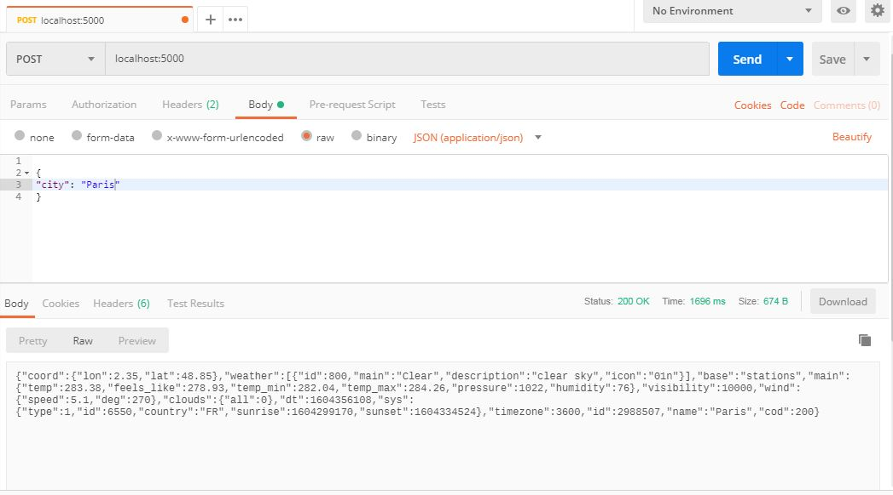
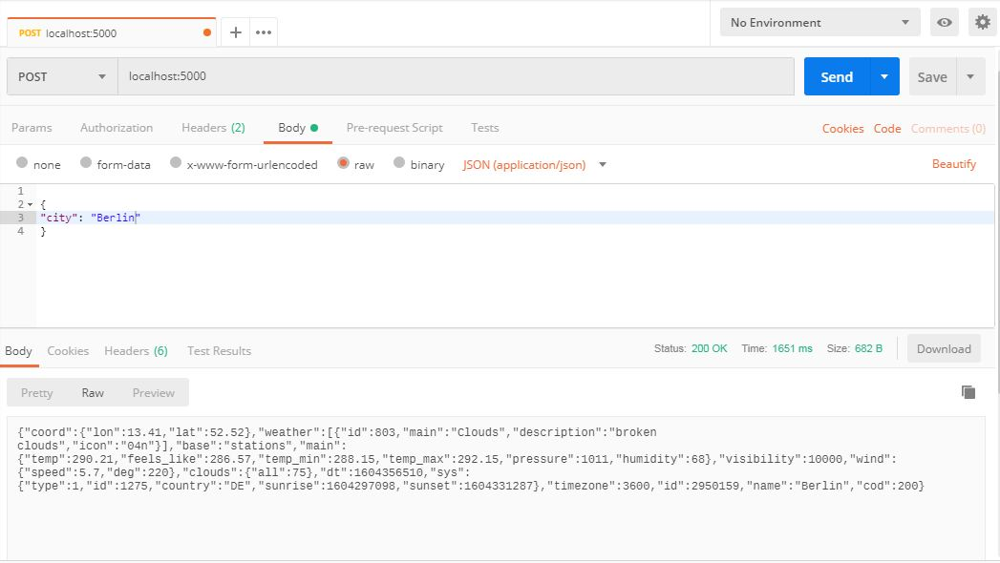
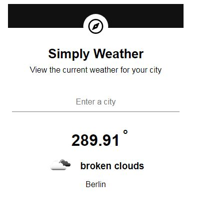
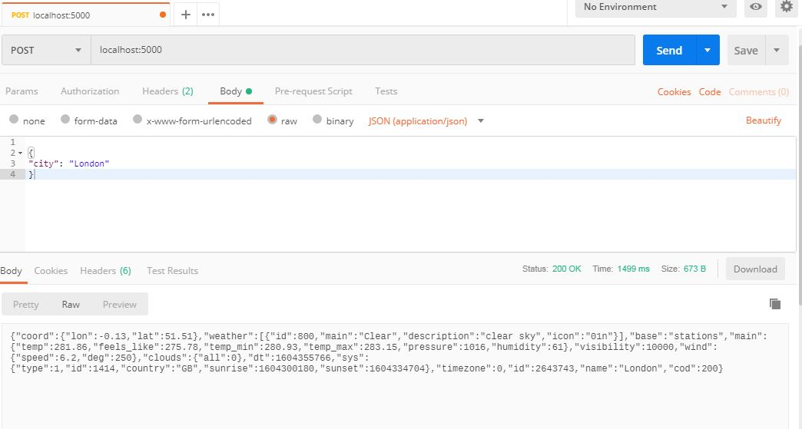
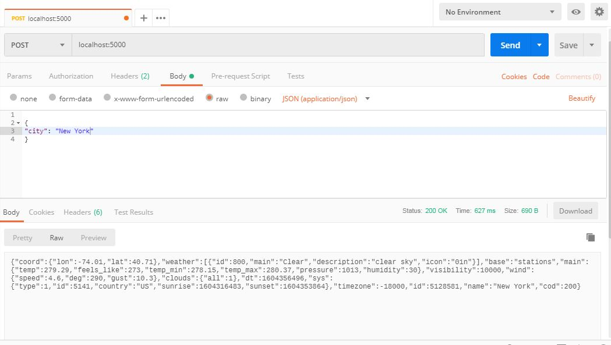
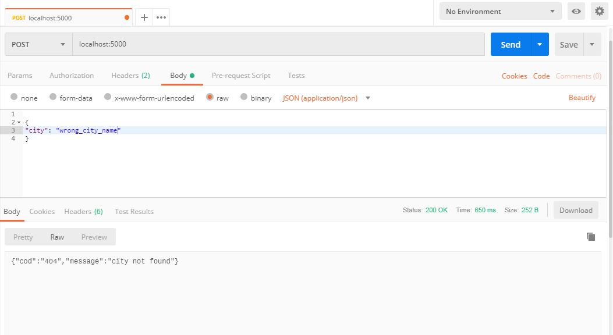
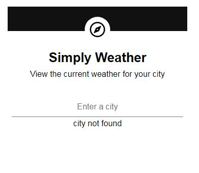

## Objectives

In this Simple project, we are going to consume the API of open weather using POSTMAN.

### Instructions

Check the link below for open weather map API:

https://openweathermap.org/api

Use that API, to try to get the weather of different cities on different times

##### PS: Read open weather API documentation.

 

#### Screenshots with POSTMAN and Navigator

##### Get the weather of Paris
- With POSTMAN

- In browser (localhost:5000)

##### Get the weather of Berlin
- With POSTMAN

- In browser (localhost:5000)

##### Get the weather of London
- With POSTMAN

- In browser (localhost:5000)

##### Get the weather of New York
- With POSTMAN

- In browser (localhost:5000)

##### Get the weather of wrong name city
- With POSTMAN

- In browser (localhost:5000)

